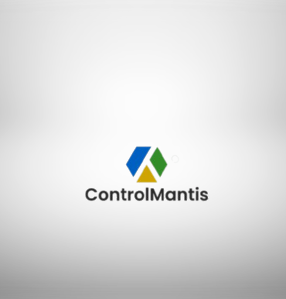

# ControlMantis

ControlMantis is a remote administration and control tool, designed for legitimate purposes to manage and monitor client systems securely. This project supports one-to-one communication and is developed by Ethan Prime (username: brownpanda29).

## Features
ControlMantis provides a range of capabilities for remote administration and control:

1. **Command and Control:** Send commands from the server to the client, execute them on the client system using the `system()` function, and receive responses.

2. **File Transfer:** Download and upload files between the server and client.

3. **Data Serialization:** Implement data serialization for efficient communication.

4. **Security:** Ensure secure communication using AES-256 encryption.

5. **Custom Command Prompt:** The server displays the client's system name as the command prompt (e.g., `client_system_name>`).

6. **Download Command:** Execute the "download" command to retrieve files from the client's system to the server.

7. **Upload Command:** Execute the "upload" command to send files from the server to the client's system.

8. **Screenshot Capture (Work in Progress):** We are actively working on implementing the capability to capture screenshots from the client's system.

## Usage
To use ControlMantis, follow these steps:

1. Build and run the server on your control machine.

2. Deploy the client on the target system.

3. Initiate a secure one-to-one connection between the server and the client.

4. Send and execute commands, transfer files, capture screenshots, and more.

## Contribution
We welcome contributions and feedback from the open-source community. Please report issues or submit pull requests to help us enhance this tool further.

## Disclaimer
ControlMantis is intended for responsible use. Any unauthorized or unethical use of this software is strictly prohibited. Please ensure that you comply with all legal and ethical guidelines when using this tool.

## Work in Progress
We are actively working on implementing the capability to capture screenshots from the client's system. Additionally, we are in the process of calibrating the code to improve performance and security.

## License
ControlMantis is open-source software, distributed under the [MIT License](LICENSE). You are free to use and modify this software in accordance with the license terms.

---

**Disclaimer: The authors and contributors of ControlMantis assume no liability for any unauthorized or unethical use of this tool. Use it responsibly and in accordance with all applicable laws and regulations.**
